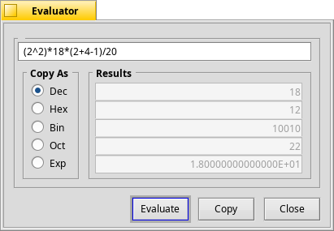

Expression Evaluator © 2000 Chris Dragan

http://chrisdragan.org

Usage:

Write an expression and see what happens.
Example:

	1 . 23 * 044 + exp ( 3e-1 + 0.4 )

Later you can either evaluate the expression or copy it to the clipboard.

Supported number formats ( C-style, Pascal-style and Assembly-style ) :
- integer decimal,
- floating-point decimal,
- floating-point exponential,
- hexadecimal,
- binary,
- octal.

Supported operators:

\+ \- \* / % ^ << >> & \| ~ && \|\| ^ ~ == = \!= <> > >= < <=

(note: ^ is power and not xor).

Supported functions:

abs, neg, sin, cos, tan (tg), ctan (ctg), asin (arcsin), acos (arccos), atan (arctan, atg, arctg), actan (arcctan, actg, arcctg), sqr, sqrt, exp, log (base 2), lg (base 10), ln (base e)

Supported constants:

pi, e, l2t, l2e, lg2, ln2

The Expression Evaluator's design is based on DOS Navigator's calculator.

### Screenshot
